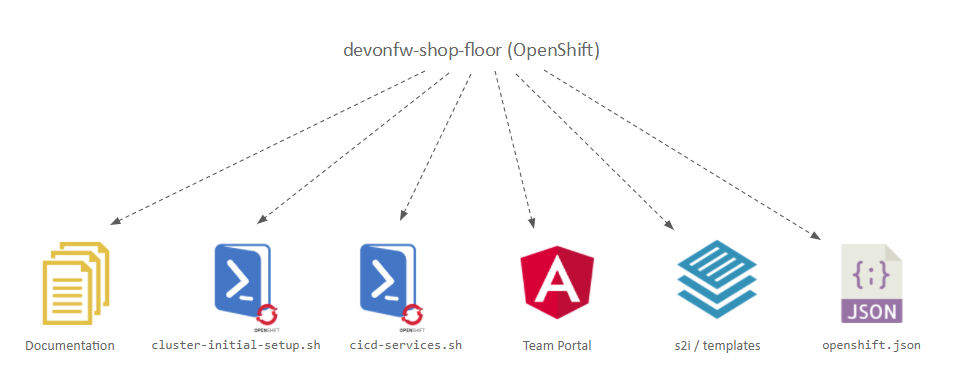
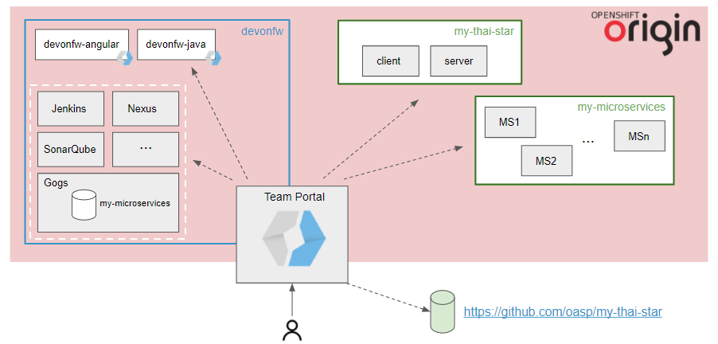

# devonfw-shop-floor 4 OpenShift

## Provided Assets



## Architecture Overview




Scripts, tools etc to create and manage OpenShift based DevOps/CI/CD/Test environment

1. Get your local cluster up with `oc cluster up` (edit: `minishift start` could be the correct command)
2. Run the `build-cicd.sh` script
3. See your environment in the Openshift Dashboard
4. Manually deploy the **Nexus** service

# Debian

## 1. Set up Docker Repository (Debian/Jessie)

```
$ sudo apt-get install \
     apt-transport-https \
     ca-certificates \
     curl \
     gnupg2 \
     software-properties-common
```

`$ curl -fsSL https://download.docker.com/linux/$(. /etc/os-release; echo "$ID")/gpg | sudo apt-key add -`

```
$ sudo add-apt-repository \
   "deb [arch=amd64] https://download.docker.com/linux/$(. /etc/os-release; echo "$ID") \
   $(lsb_release -cs) \
   stable"
```

## 2. Install Docker CE

`$ sudo apt-get update`

`$ sudo apt-get install docker-ce`

## 3. Install OpenShift Client tools

`$ wget https://github.com/openshift/origin/releases/download/v3.6.0/openshift-origin-client-tools-v3.6.0-c4dd4cf-linux-64bit.tar.gz`

`$ tar –xvf openshift-origin-client-tools-v3.6.0-c4dd4cf-linux-64bit.tar.gz`

`$ mv openshift-origin-client-tools-v3.6.0-c4dd4cf-linux-64bit.tar.gz oc-tool`

## 4. Add **oc** to PATH

`$ export PATH=<dir/to/oc-tool>/oc-tool:$PATH`

`# export PATH=<dir/to/oc-tool>/oc-tool:$PATH`

## 5. Add "172.30.0.0/16" as "insecure-registry" for the Docker Daemon

`$ vim /etc/docker/daemon.json`

Add this to the new file:

```
{
  "insecure-registries" : ["172.30.0.0/16"]
}
```
Close and save no VIM by typing: `ESC` and writing `:wq` standing for "Write" and "Quit"


# RHEL

## How to install RHEL

In order to install RHEL, your must follow all steps defined in the following [link](https://developers.redhat.com/products/rhel/hello-world/#fndtn-bare-metal)

If you want to enable EPEL repository, execute the following command:

```
# rpm -ivh https://dl.fedoraproject.org/pub/epel/epel-release-latest-7.noarch.rmp
# yum -y update
```

## How to install Red Hat Container Development Kit (CDK)

The following commands only works in RHEL, for other SO check the [Red Hat developers web page](https://developers.redhat.com/products/cdk/hello-world/#fndtn-windows)

1. Enable some software repositories

```
$ su -
# subscription-manager repos --enable rhel-7-server-devtools-rpms
# subscription-manager repos --enable rhel-server-rhscl-7-rpms

```
2. Add the Red Hat Developer Tools key to your system

```
# cd /etc/pki/rpm-gpg
# wget -O RPM-GPG-KEY-redhat-devel https://www.redhat.com/security/data/a5787476.txt
# rpm --import RPM-GPG-KEY-redhat-devel
```

3. Install all of the tools in Red Hat Development Suite

```
# yum install rh-devsuite
```

4. Install only Red Hat Container Development Kit 3.1

```
# yum install cdk-minishift docker-machine-kvm
```

5. Add the minishift command to the system path

```
# ln -s /var/lib/cdk-minishift-3.0.0/minishift /usr/bin/minishift
```

6. Setup the minishift VM and download additional components

```
# exit
$ minishift setup-cdk --force --default-vm-driver="kvm"
```

7. Add the OpenShift oc command to the system path

```
$ su 
# ln -s /home/$(whoami)/.minishift/cache/oc/v3.5.5.8/oc /usr/bin/oc
```

8. Finally, start OpenShift

```
# exit
$ minishift start
```

## Devonfw Primed by Red Hat for OpenShift


## How to use Private Git Repositories

 - [Repository SSH Keys](https://blog.openshift.com/private-git-repositories-part-2a-repository-ssh-keys/)
 - [Using Secrets from the Command Line](https://blog.openshift.com/private-git-repositories-part-2b-repository-ssh-keys/)

## Resources

 - [Openshift books](https://developers.openshift.com/overview/books.html)
 - edX course: 
[Fundamentals of Containers, Kubernetes, and Red Hat OpenShift](https://courses.edx.org/courses/course-v1:RedHat+DO081x+2T2017/course/)
 - [oc cluster wrapper](https://github.com/openshift-evangelists/oc-cluster-wrapper)
 - [minishift demo](https://github.com/nearform/minishift-demo)
  - [Best Practices](https://blog.openshift.com/private-git-repositories-part-1-best-practices/) to use a Private Git Repository.